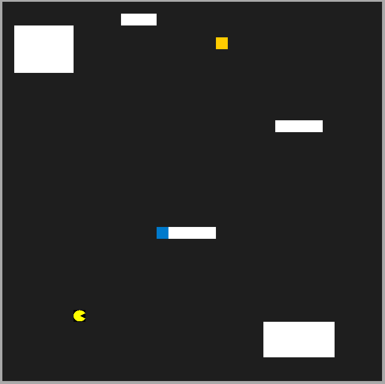

# Snake vs PacMan

Inspired by two classic arcade games, Snake vs PacMan builds on the Udacity C++ Capstone Project [CppND-Capstone-Snake-Game](https://github.com/udacity/CppND-Capstone-Snake-Game.git) by adding new features. The primary features added are the PacMan and Obstacle classes (located in the src directory). On initialisation, PacMan and Snake are rendered at opposite corners of the playing arena along with 4 randomly generated obstacles and a single food token. Pacman uses the A* search algorithm to find the shortest path to the food while navigating around the obstacles. Meanwhile, playing as Snake, your objective is to beat PacMan to the food. However, if PacMan is careless enough to get in your way, simply eat him instead!

## Dependencies

* cmake >= 3.7
  * All OSes: [click here for installation instructions](https://cmake.org/install/)
* make >= 4.1 (Linux, Mac), 3.81 (Windows)
  * Linux: make is installed by default on most Linux distros
  * Mac: [install Xcode command line tools to get make](https://developer.apple.com/xcode/features/)
  * Windows: [Click here for installation instructions](http://gnuwin32.sourceforge.net/packages/make.htm)
* SDL2 >= 2.0
  * All installation instructions can be found [here](https://wiki.libsdl.org/Installation)
  >Note that for Linux, an `apt` or `apt-get` installation is preferred to building from source.
* gcc/g++ >= 5.4
  * Linux: gcc / g++ is installed by default on most Linux distros
  * Mac: same deal as make - [install Xcode command line tools](https://developer.apple.com/xcode/features/)
  * Windows: recommend using [MinGW](http://www.mingw.org/)

## Basic Build Instructions

1. Clone this repo.
2. Make a build directory in the top level directory: `mkdir build && cd build`
3. Compile: `cmake .. && make`
4. Run it: `./SnakeGame`.

## Rubric Items Completed

1. README (All Rubric Points REQUIRED)
- 1.1 - A README with instructions is included with the project
- 1.2 - The README indicates which project is chosen.
- 1.3 - The README includes information about each rubric point addressed.

2. Compiling and Testing (All Rubric Points REQUIRED)
- 2.1 - The submission must compile and run.

3. Loops, Functions, I/O
- 3.1 - The project demonstrates an understanding of C++ functions and control structures.

- 3.2 - The project reads data from a file and process the data, or the program writes data to a file. (src/pacman.cpp, line 11)

4. Object Oriented Programming
- 4.1 - The project uses Object Oriented Programming techniques. (src/pacman.cpp, src/pacman.h, src/obstacle.cpp, src/obstacle.h)
- 4.2 - Classes use appropriate access specifiers for class members. (src/pacman.h, src/obstacle.h)
- 4.3 - Class constructors utilize member initialization lists. (src/pacman.cpp, src/obstacle.cpp)
- 4.5 - Classes encapsulate behavior. (src/pacman.h, src/obstacle.h)

5. Memory Management
- 5.1 The project makes use of references in function declarations. (src/pacman.h lines 29 and 46)
- 5.6 - The project uses smart pointers instead of raw pointers. (src/game.h line 27)

## CC Attribution-ShareAlike 4.0 International

Shield: [![CC BY-SA 4.0][cc-by-sa-shield]][cc-by-sa]

This work is licensed under a
[Creative Commons Attribution-ShareAlike 4.0 International License][cc-by-sa].

[![CC BY-SA 4.0][cc-by-sa-image]][cc-by-sa]

[cc-by-sa]: http://creativecommons.org/licenses/by-sa/4.0/
[cc-by-sa-image]: https://licensebuttons.net/l/by-sa/4.0/88x31.png
[cc-by-sa-shield]: https://img.shields.io/badge/License-CC%20BY--SA%204.0-lightgrey.svg
